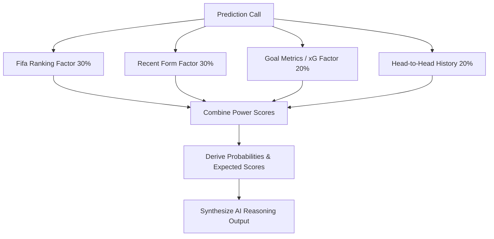

# Football Score (FIFA World Cup Dashboard) Project Documentation

Welcome to the **Football Score** project documentation. This is a state-of-the-art live dashboard and analysis platform for tracking the FIFA World Cup, featuring real-time scores, match telemetry logs, interactive statistics, custom lineups, and algorithmic AI match predictions.

---

## 🌟 Project Overview

**Football Score** is built using Next.js 15, React 19, and Tailwind CSS. The app features:
1. **Multi-Language Translation Support**: Configured for 6 global languages (`en`, `es`, `fr`, `de`, `pt`, `ar`) with full Right-to-Left (RTL) reading compatibility for Arabic.
2. **Interactive Live Feeds**: Interfaced directly with ESPN's sports API, proxying requests server-side or client-side with fallback mock safety nets.
3. **Custom Match Outcome Forecast Engine**: A detailed rule-based scoring model calculating match outcomes based on ranking, past form, goal differentials, and head-to-head records.
4. **Knockout Stage Projector**: Visual and interactive tournament bracket modeling.
5. **Robust UI/UX Components**: Animated micro-interactions powered by `framer-motion`, beautiful dark/light themes, and data charts rendered with `recharts`.

---

## 📁 Repository Directory Structure

The project follows a standard Next.js App Router structural layout:

```yaml
g:/FIFA-web/
├── app/                       # Next.js App Router Page Tree
│   ├── api/                   # API Route Endpoints
│   │   ├── espn/              # ESPN Scoreboard & Standings Proxy
│   │   └── predict/           # AI Match Predictor Endpoint
│   ├── live/                  # Real-Time Telemetry & Video Stream Dashboard
│   ├── matches/               # Fixtures List & Dynamic Match Analytics
│   │   └── [id]/              # Individual Match Scorecard & Event Logs
│   ├── players/               # Squad Roster & Players Performer Spotlight
│   ├── predictions/           # Algorithmic Match Selector & Simulation Page
│   ├── privacy/               # Privacy Policy
│   ├── standings/             # League Tables & World FIFA Rankings
│   ├── teams/                 # National Teams Squad Overview
│   │   └── [id]/              # Individual National Team Details
│   ├── terms/                 # Terms of Service
│   ├── globals.css            # Global CSS Styles & Tailwind Directives
│   ├── layout.tsx             # Root Application Template & Context Wrappers
│   └── page.tsx               # Home Dashboard Page
├── components/                # Reusable React UI Components
│   ├── Footer.tsx             # Global Platform Footer
│   ├── LanguageProvider.tsx   # Translation & RTL Context Provider
│   ├── LiveScoreBar.tsx       # Live Matches Score Ticker
│   ├── MatchCard.tsx          # Match Overview & Detailed Lineup/Stats Card
│   ├── MobileNav.tsx          # Mobile Navigation Sticky Footer
│   ├── Navbar.tsx             # Main Header with Brand, Search, Locale & Theme toggles
│   ├── PredictionCard.tsx     # AI Probability & Reasoning Component
│   ├── ThemeProvider.tsx      # Dark Mode Toggle State Provider
│   └── TournamentBracket.tsx  # Knockout Round Interactive Diagram
├── lib/                       # Business Logic & Data Utilities
│   ├── api.ts                 # ESPN Fetching API Client with Mock Fallbacks
│   ├── mockData.ts            # Type Interfaces & Static Datasets
│   ├── predictionEngine.ts    # Algorithmic Match Prediction Calculations
│   ├── translations.ts        # Language Resource Dictionaries
│   └── utils.ts               # CSS Class-merging Helper Utilities
├── package.json               # Project Dependencies & npm Scripts
├── tsconfig.json              # TypeScript Options Configuration
└── README.md                  # Basic Application Setup Guide
```

---

## 🛠️ Technology Stack & Dependencies

The system employs modern frontend tools to deliver high performance and premium styling:

* **Core Framework**: [Next.js 15.5.19](https://nextjs.org/) (App Router architecture)
* **Runtime Library**: [React 19.1.0](https://react.dev/)
* **Styles & Layout**: [Tailwind CSS v4](https://tailwindcss.com/) with PostCSS directives
* **Animations**: [Framer Motion v12](https://github.com/framer/motion)
* **Data Visualization**: [Recharts v3](https://recharts.org/)
* **Icon Set**: [Lucide React](https://lucide.dev/)
* **Formatting Utilities**: `clsx` and `tailwind-merge`

---

## ⚡ Core Systems Architecture

### 1. Localization & RTL System (`lib/translations.ts` & `components/LanguageProvider.tsx`)
* Supports multiple locales: English (`en`), Spanish (`es`), French (`fr`), German (`de`), Portuguese (`pt`), and Arabic (`ar`).
* Provides a `LanguageContext` exposing translation lookup helper `t(key)` and layout direction `dir` ("rtl" for Arabic, "ltr" for others).
* When a user changes the language:
  * The root HTML element's `lang` and `dir` attributes update dynamically.
  * Component styling changes appropriately to support RTL flows.

### 2. Live Scores & API Integration (`lib/api.ts` & `app/api/espn/route.ts`)
* Matches, standings, rosters, and stats are fetched dynamically using a Node proxy endpoint `/api/espn`.
* This proxy queries ESPN APIs directly:
  * **Scoreboard**: `https://site.api.espn.com/apis/site/v2/sports/soccer/fifa.world/scoreboard`
  * **Standings**: `https://site.api.espn.com/apis/v2/sports/soccer/fifa.world/standings`
  * **Roster**: `https://site.api.espn.com/apis/site/v2/sports/soccer/fifa.world/teams/{id}/roster`
  * **Match Details**: `https://site.api.espn.com/apis/site/v2/sports/soccer/fifa.world/summary`
* **Caching & Fallback**:
  * Responses are cached for `10` seconds during live lookups.
  * In the event that ESPN's endpoints are offline, rate-limited, or unseeded, the `ApiClient` transparently falls back to structural mocks from `lib/mockData.ts` to guarantee zero-downtime display.
  * Pinned teams (Favorites) are stored locally in the client's `localStorage` and shared dynamically across views using a simple subscriber architecture.

### 3. Match Prediction Model (`lib/predictionEngine.ts`)
The `calculatePrediction` function computes probabilities and generates detailed AI commentary:



#### Detailed Scoring Weights
1. **FIFA Ranking (30%)**: Evaluated using the ranking differential between teams.
2. **Recent Form (30%)**: Normalizes the results of the team's last 3 matches (3 points for a Win, 1 for a Draw, 0 for a Loss).
3. **Goal Metrics & expected Goals (20%)**: Estimates expected goals (xG) based on team averages (goals scored vs goals conceded) scaled for attack strength and defensive resistance.
4. **Head-to-Head History (20%)**: Factors in points won in past direct matchups between the two countries.

The engine compiles these inputs to predict home/away/draw probability splits, expected scoreline numbers, a confidence rating (`Low`, `Medium`, `High`), and generates a localized natural-language explanation.

---

## 📡 API Reference Endpoints

### 1. ESPN Proxy
* **Route**: `/api/espn`
* **Method**: `GET`
* **Query Parameters**:
  * `endpoint`: `scoreboard` | `summary` | `teams` | `roster` | `standings`
  * `dates` (optional): Scoreboard date range (e.g., `20260611-20260719`)
  * `event` (optional): Specific ESPN Match Event ID for summary lookups
  * `team` (optional): Team ID for squad rosters
  * `season` (optional): Standings season (defaults to `2026`)

### 2. Simulation Predictor
* **Route**: `/api/predict`
* **Method**: `GET`
* **Query Parameters**:
  * `home`: Home team unique code/ID
  * `away`: Away team unique code/ID
* **Response Output Structure**:
  ```json
  {
    "homeTeam": { ... },
    "awayTeam": { ... },
    "homeWinProb": 52,
    "drawProb": 23,
    "awayWinProb": 25,
    "predictedHomeScore": 2,
    "predictedAwayScore": 1,
    "confidence": "Medium",
    "homeXG": 1.85,
    "awayXG": 1.10,
    "reasoning": "Our AI model predicts a medium confidence outcome..."
  }
  ```

---

## 🏃 Run the Application Locally

To download dependencies and launch the dev server on your local environment:

### 1. Installation
Ensure Node.js is installed. Run the following command in the project root:
```bash
npm install
```

### 2. Run Development Server
Start the local server with hot reloading enabled:
```bash
npm run dev
```
Navigate to [http://localhost:3000](http://localhost:3000) on your web browser.

### 3. Build & Production Run
To build and inspect the optimized production bundles:
```bash
npm run build
npm run start
```
